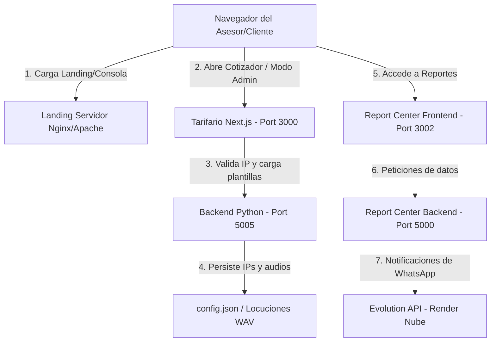

# Guía de Despliegue y Arquitectura de Sistemas – DreamTeam 2026

Esta guía describe el procedimiento de instalación, configuración y despliegue en producción de la suite web de **DreamTeam Contact Center**, compuesta por cuatro componentes integrados:

1. **Landing Page Corporativa** (HTML/JS/CSS Estático)
2. **Tarifario Inteligente** (Aplicación Next.js)
3. **Centro de Reportes (Report Center)** (Frontend en Vite y Backend en Express)
4. **Backend de Permiso Llamada y Seguridad** (Servicio Local Python)

---

## 🏗️ Arquitectura y Flujo de Datos



---

## 🛠️ Requisitos Previos en el Servidor

* **Node.js**: Versión `18.x` o superior (se recomienda LTS).
* **Python**: Versión `3.10.x` o superior.
* **Administrador de procesos**: `PM2` para mantener los servicios Node y Python activos en segundo plano.
* **Servidor Web / Proxy Inverso**: Nginx o IIS para redireccionar tráfico y servir archivos estáticos.

---

## 🚀 Paso 1: Despliegue de la Landing Corporativa (Estático)
La carpeta `landing` contiene código HTML5 estático optimizado, incluyendo la Consola de Colaboradores.

1. **Ruta en Servidor**: Copiar el contenido de la carpeta `landing` al directorio raíz de tu servidor web (ej. `/var/www/dreamteam-landing` en Nginx o `C:\inetpub\wwwroot` en IIS).
2. **Favicon Unificado**: Ya se encuentra configurado el tag `<link rel="icon" type="image/png" href="images/dreamlogo.png?v=3">` que apunta al isotipo oficial de la "D" de DreamTeam en alta resolución, unificando la identidad visual con el CRM.
3. **Formulario de Candidaturas (Formspree)**: El botón "Enviar Candidatura" al final de la landing page procesa y envía automáticamente el CV físico (PDF/Word) y datos de contacto a la dirección de correo corporativa **`wrosario@dreamteam.pe`** a través de Formspree de manera transparente.
4. **Configuración de Nginx (Ejemplo)**:
   ```nginx
   server {
       listen 80;
       server_name dreamteam.internal; # O tu dominio público
       root /var/www/dreamteam-landing;
       index index.html;
       
       location / {
           try_files $uri $uri/ =404;
       }
   }
   ```

---

## ⚙️ Paso 2: Despliegue del Backend de Permiso Llamada (Python)
Este servicio administra las plantillas de aviso legal en audio, mezcla música de fondo y almacena de forma física los archivos WAV. Adicionalmente, actúa como la persistencia para el sistema de control de IP de la oficina.

1. **Ruta de Archivos**: Ubicar la carpeta `permiso-llamada-backend` en el servidor.
2. **Instalación de Dependencias**:
   Ejecutar en la terminal del sistema:
   ```bash
   pip install flask flask-cors edge-tts pydub
   ```
   *Nota: Requiere la herramienta del sistema `ffmpeg` instalada y agregada al PATH para permitir la mezcla y exportación de archivos WAV en caliente.*
3. **Persistencia**: La configuración y la lista de IPs autorizadas se guardan automáticamente en el archivo `config.json`.
4. **Ejecución en Segundo Plano (Puerto 5005)**:
   * **Con PM2**:
     ```bash
     pm2 start app.py --name "dt-permiso-backend" --interpreter python3
     ```
   * **Con Python directo**:
     ```bash
     python app.py
     ```

---

## 💻 Paso 3: Despliegue del Tarifario Inteligente (Next.js)
El cotizador está desarrollado sobre el framework **Next.js** utilizando TypeScript.

1. **Instalación de Dependencias**:
   Desde la carpeta `tarifario-smart`, ejecuta:
   ```bash
   npm install
   ```
2. **Generar Compilación de Producción (Optimizado)**:
   ```bash
   npm run build
   ```
3. **Ejecución en Producción**:
   Se recomienda levantar la aplicación mediante `PM2` para asegurar su reinicio automático en caso de caídas:
   ```bash
   pm2 start npm --name "dt-tarifario-front" -- run start -- --port 3000
   ```
4. **Favicon**: Está declarado en la metadata del layout de Next.js (`/favicon.png`) para apuntar al isotipo oficial de la "D" de DreamTeam.

---

## 📊 Paso 4: Despliegue del Centro de Reportes (Report Center)
El Centro de Reportes está dividido en un Backend en Express y un Frontend en Vite.

### 4.1 Backend (Express - Puerto 5000)
El backend está configurado en producción para **apuntar directamente a la Evolution API en Render (Nube)** en lugar de un servidor local. Esto elimina la necesidad de desplegar o mantener la carpeta `evolution-api` localmente, lo que reduce la carga del servidor de la oficina.

1. **Ruta de Archivos**: Carpeta `report-center/backend`.
2. **Variables de Entorno (.env)**:
   El archivo `.env` ya viene configurado para producción en la nube:
   ```env
   PORT=5000
   NODE_ENV=production
   EVOLUTION_API_URL=https://evolution-api-smart.onrender.com
   EVOLUTION_API_KEY=NEXO_SECRET_KEY_2026
   ```
3. **Instalación e Inicio**:
   ```bash
   npm install
   pm2 start src/index.ts --name "dt-report-backend"
   ```
4. **Sistema Keep-Alive de Instancias de WhatsApp**:
   Aprovechando que el backend del Report Center se ejecuta 24/7 de forma persistente, el planificador (`SchedulerService.ts`) realiza una petición HTTP silenciosa cada 5 minutos a las 3 instancias de WhatsApp de la Evolution API en Render:
   * `smart-telco` (Propuestas)
   * `contraofertas-dreamteam` (Contraofertas)
   * `dreamteam` (Reportes)
   
   Esto evita que los servidores de Render duerman los contenedores de propuestas/contraofertas por inactividad y mantiene las conexiones de Baileys siempre estables y sincronizadas.

### 4.2 Frontend (Vite - Puerto 3002)
El cliente visual del Centro de Reportes (Consola de Colaboradores).
1. **Ruta de Archivos**: Carpeta `report-center/frontend`.
2. **Instalación e Inicio**:
   ```bash
   npm install
   # Para iniciar servidor estático de producción:
   npm run build
   pm2 start "npx vite --port 3002" --name "dt-report-front"
   ```

---

## 🛡️ Parámetros de Seguridad e Integración de IP Corporativa

El sistema de seguridad de IP está integrado de forma síncrona:
* Al arrancar, el front (Next.js) consulta la configuración de seguridad al puerto `5005` del backend Python.
* Detecta la IP del cliente del asesor utilizando `api.ipify.org` con fallback redundante a `ipapi.co`.
* Si la restricción de IP está **habilitada** (`ip_restriction_enabled: true` en `config.json`) y la IP del navegador no se encuentra en `allowed_ips`, la pantalla se bloquea inmediatamente con la UI de **Acceso Restringido**.
* **Contraseña Maestra / Bypass de Supervisor**:
  * Para saltarse el bloqueo en una máquina autorizada o añadir una IP en caliente, el supervisor puede presionar el botón de bypass e ingresar la clave maestra de administración:
  * 🔑 **`DT2026ADMIN`**
